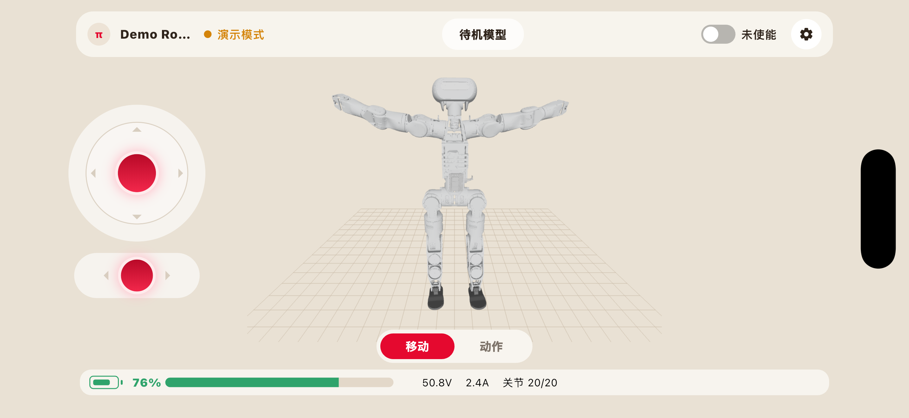
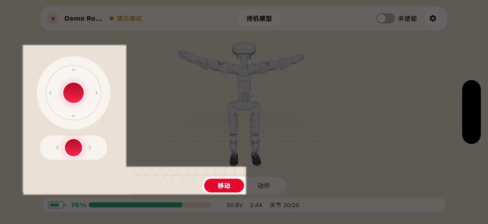
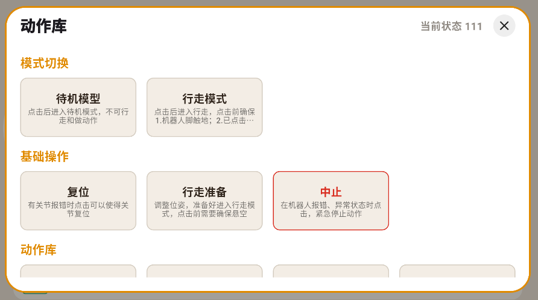

动作交互
###################

动作交互功能用于通过软件界面控制机器人执行指定动作。用户点击相应的动作按钮后，软件将向机器人发送动作指令，机器人根据当前状态执行对于动作。

软件提供以下两种动作交互方式：

* 移动面板

* 动作库

使用动作交互功能前，请确保机器人已经正常启动并成功连接软件、上使能、当前状态允许执行动作，同时确认机器人周围环境符合安全要求。

有关安全距离、操作限制及异常处理方式，请参考动作交互注意事项。

.. note::
 机器人上使能时需要选择姿态，请务必与当前机器人实际姿态保持一致。

移动面板控制
---------------------

用户可通过3D模型界面左侧的两个移动面板控制机器人运动。

.. list-table:: 圆形移动面板说明
   :widths: 50 50 50
   :header-rows: 1

   * - 按钮
     - 机器人反应
     - 说明
   * - 上
     - 前进
     - 按住按钮、向上滑动并保持，控制机器人沿当前朝向向前移动
   * - 下
     - 后退
     - 按住按钮、向下滑动并保持，控制机器人向后移动
   * - 左
     - 左转
     - 按住按钮、向左滑动并保持，控制机器人向左前方转向并前进
   * - 右
     - 右转
     - 按住按钮、向右滑动并保持，控制机器人向右前方转向并前进

.. list-table:: 跑道形移动面板说明
   :widths: 50 50 50
   :header-rows: 1

   * - 按钮
     - 机器人反应
     - 说明
   * - 左
     - 向左平移
     - 按住按钮、向左滑动并保持，控制机器人向左平移
   * - 右
     - 向右平移
     - 按住按钮、向右滑动并保持，控制机器人向右平移

.. warning::
 移动控制会使机器人发生实际位移。
 操作期间，操作人员应与机器人保持安全距离，并确保机器人运动路径始终处于可视范围内。
 

动作库控制
---------------------

动作库用于集中展示机器人支持的预设动作。动作库中的动作已经完成动作编排，用户无需单独控制机器人关节，点击相应的动作按钮后，软件会向机器人发送动作执行指令，机器人按照预设的动作顺序、速度和幅度完成整套动作。

点击“动作”进入动作库页面，该页面包含以下三个内容：

* 模式切换

* 基础操作 

* 动作库

模式切换
+++++++++++++++++++++

模式切换包括：

* 待机模式：点击后进入待机模式，该模式下机器人不可行走、不可做动作。

* 行走模式：点击后进入行走模式，需确保机器人的脚已接触地面，且已经在“基础操作”中点击了“行走准备”。

基础操作
+++++++++++++++

* 复位：出现关节报错时点击该按钮，可使关节复位。

* 行走准备：在进入行走模式前点击该按钮，可以调整机器人位姿，使其做好行走准备。点击该按钮时，机器人应该悬空。

* 中止：在机器人出现报错及异常状态时点击该按钮，能紧急停止机器人动作。

动作库
+++++++++++++++

目前已编排好的动作有：

* 点头

* 摇头

* 左、右挥手

* 高、低挥手

* 右手敬礼

* 右手握手

* 拥抱

* 摇头晃脑

* 鼓掌

* 害羞

* 观望

* 欢呼

.. danger::
 使用时，若机器人出现任何非预期运动或其他紧急情况，请立即按急停按钮。
 急停后，应先排除危险因素，再按照规定完成急停解除、复位和使能操作。