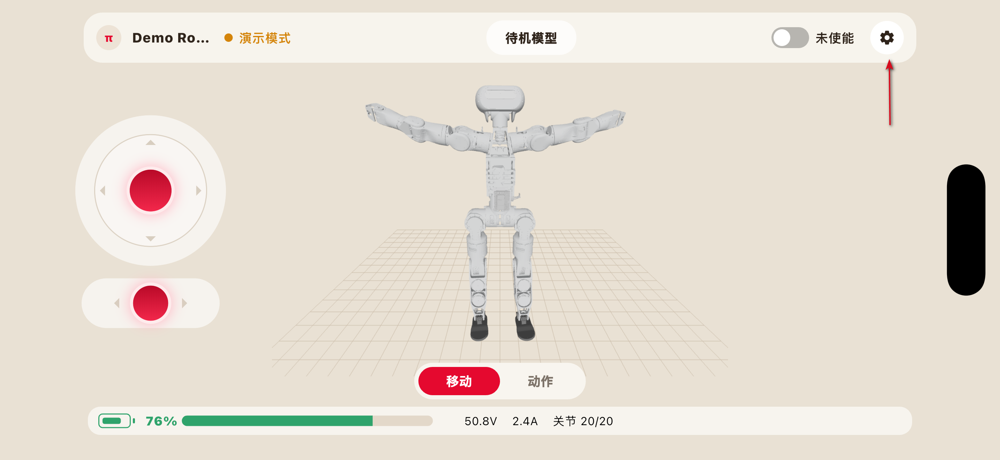
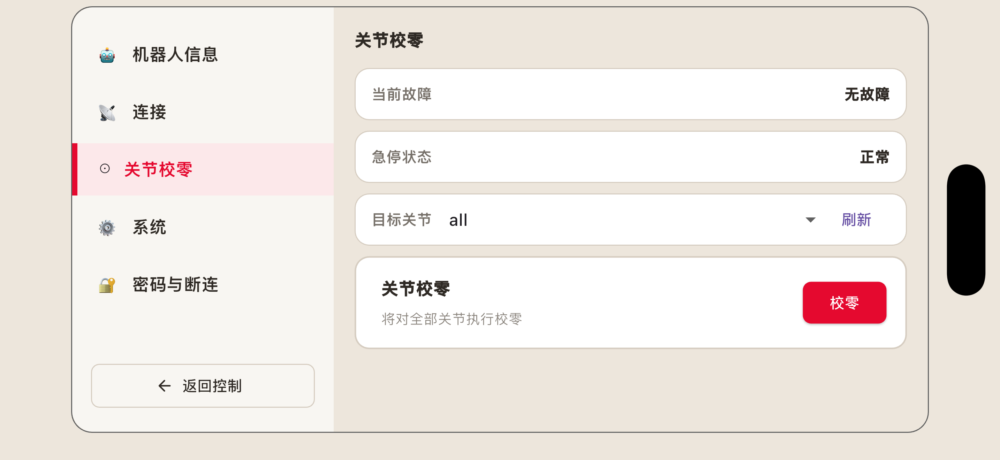
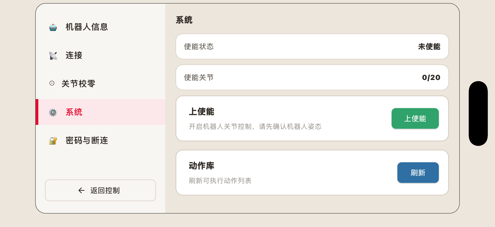
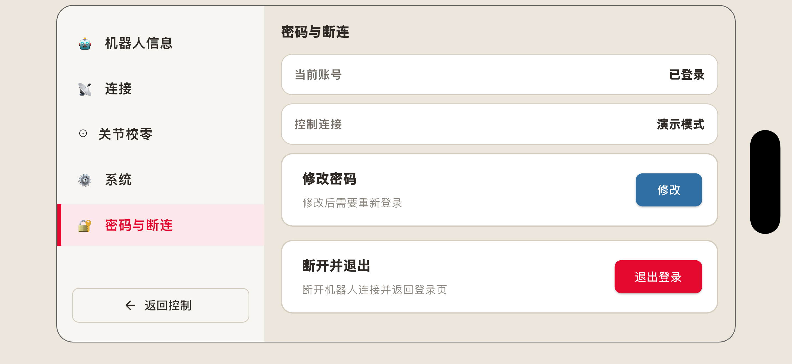

机器人设置
################

设置界面用于查看机器人相关信息、执行关节校零、检查动作库更新、修改密码等功能。

鉴于前文已经介绍过关于机器人信息查看与软件升级的相关内容，此章节只介绍关节校零、系统、密码与断连这三个页面的内容。

关节校零
-----------------

关节校零页面用于检测和校准机器人各关节的机械零位，使关节反馈位置与实际位置保持一致。

关节零位发生偏差时，可能导致机器人姿态异常、动作执行不准确或部分动作无法正常完成。

.. danger::
 关节校零属于专业维护操作。校零过程中机器人关节可能发生运动，操作不当可能导致机器人倾倒、碰撞或关节损坏。
 非专业人员不得擅自执行关节校零。

进入关节校零页面后，可看到：

* 当前故障：显示当前是否有故障

* 急停状态：显示急停是否正常

* 目标关节：用户可在此处选择目标关节。选择好后，可点击下方的“校零”，则将对选择的相应关节进行校零操作。

系统
----------------

系统页面可查看机器人的使能状态与已使能的关节数量。

点击“下使能”可使机器人下使能，该操作会释放机器人关节，请确认机器人处于安全姿态。

点击“动作库”可刷新动作列表。

密码与断连
---------------------

该页面可查看当前帐号的登录状态与控制连接模式。

点击“修改”可修改当前帐号的登录密码。

点击“退出登录”会断开与当前机器人的连接，并返回登录页。