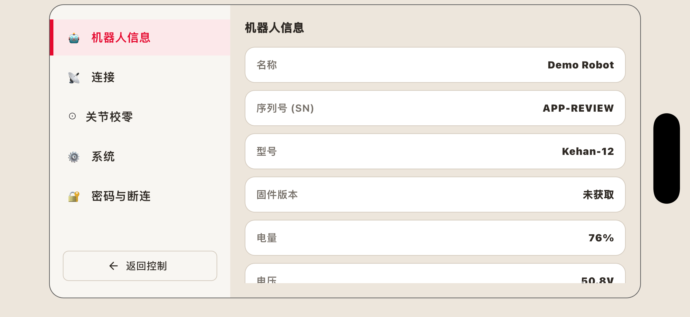
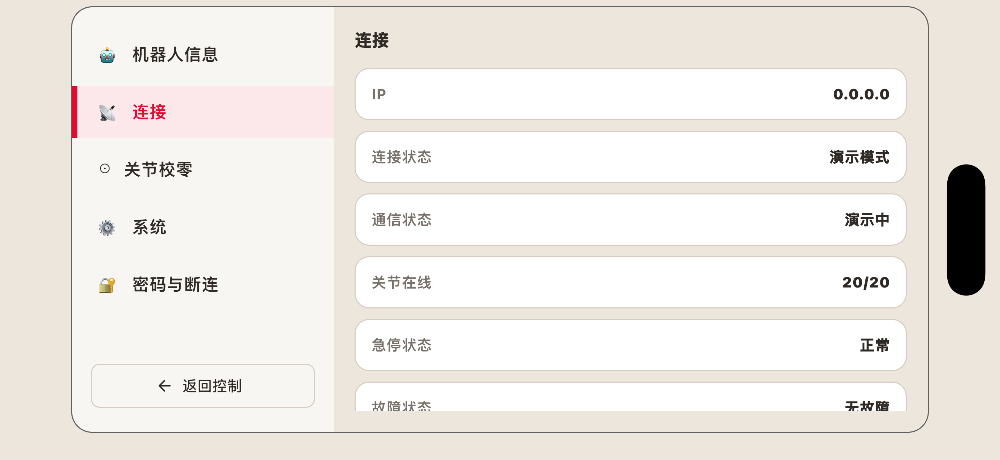

连接机器人
#################

在操控机器人之前，需要先完成账号准备与设备连接。本章将依次介绍账号与权限的配置、登录方式，以及如何将App与机器人建立连接，完成后即可进入正式操作。

帐号与权限
*****************
首先，请确认您已拥有可用账号，并获得相应的操作权限。

连接步骤
*************
账号与权限就绪后，即可启动App，并与机器人建立连接。

1. 确定机器人已开机；
2. 在操作设备中找到设置-无线网域局，将设备连接至机器人的WiFi中。WiFi默认密码为12345678。
3. 打开软件，点击“IP连接”，在跳出的窗口中输入机器人IP地址与密码，然后点击“建立安全连接”。默认IP地址为10.42.0.1；默认密码为123456。
4. 连接成功后，正式进入软件界面。

查看连接状态
***********************

点击页面右上角的设置按钮，可进入设置界面查看机器人信息与连接状态。

机器人信息包括：机器人名称、序列号、型号、固件版本、当前电量、电压以及电流。

连接状态包括：机器人IP地址、当前连接状态、当前通信状态、关节在线数量、急停状态是否正常，以及故障状态是否正常。

